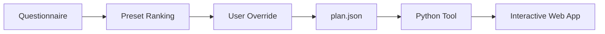

# Cernodata Engine Execution Flow

Overview of the planner, plan execution, and web visualization workflow.

## Execution Flow

1. **Plan Generation (`--create-plan`)**:
   The planner queries document characteristics (taxonomy, language) and environment constraints (hardware, speed/quality target, air-gapped security). It scores preset suitability (`docling_fast`, `docling_deep`, `vision_llm_direct`), proposes an execution order, and allows user overrides. The resulting configuration is saved to `output/plan.json`.

2. **Plan Execution (`--plan output/plan.json`)**:
   The Python tool executes the plan's primary preset, verifies quality confidence against the target threshold, and invokes fallback queue presets if quality heuristics fail.

3. **Visual Inspection (`--view` / `--serve`)**:
   The interactive web app (`output/interactive_viewer.html`) renders bounding box overlays, quality violations, and plan execution metadata with zero emojis. Use `--serve` to run a local server with live rerun endpoints.
